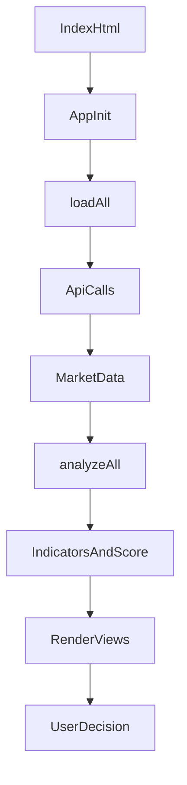
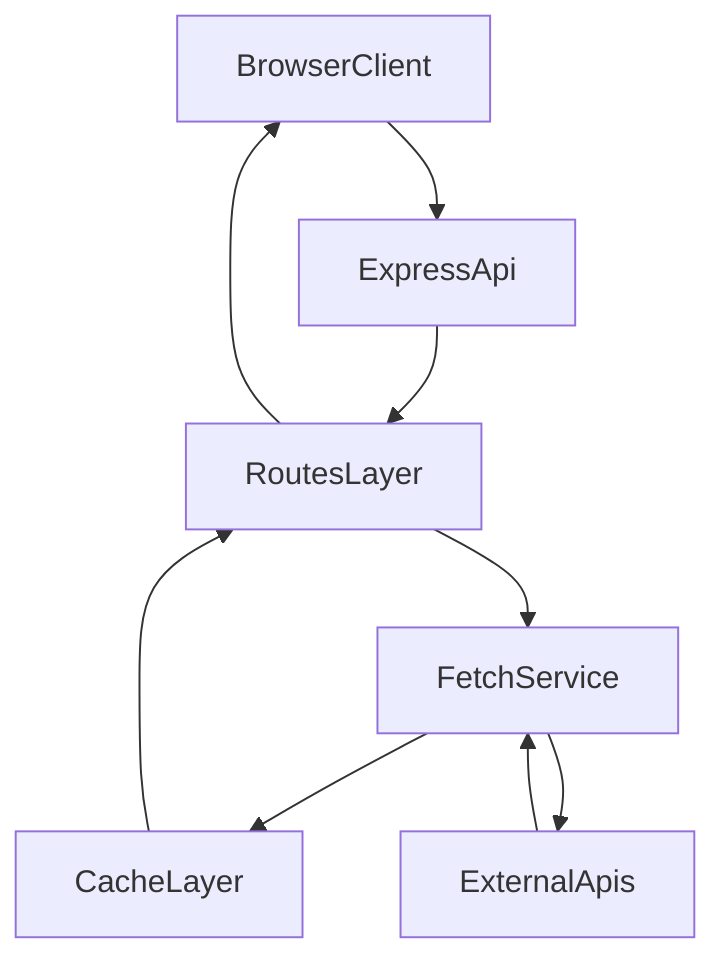

## ContractTradingTool（CTBox）

一个“静态前端 + Node/Express API 代理”的合约看板工具。  
前端负责展示和指标计算，后端负责跨域聚合第三方数据并提供轻量缓存。

> 免责声明：本项目仅用于学习与信息聚合展示，不构成任何投资建议。加密资产波动极大，请自行评估风险。

## 你会得到什么

- 合约分析面板：多指标聚合 + 多空信号可视化
- 事件合约页：基于同一套指标的方向建议
- 监控页：涨跌、费率、清算、持仓、多空比异动
- 计算器页：爆仓价、风险等级、止盈止损辅助
- 直播页：直播间情绪方向（当前数据源需自行补齐）

## 环境要求

- Node.js：建议 `20.x` 或 `22.x`（LTS）
- npm：随 Node 自带

## 快速开始（推荐）

### 1) 安装依赖

```bash
npm install
```

### 2) 启动后端 API（必需）

```bash
npm start
```

首次启动前建议先复制环境变量模板：

```bash
cp .env.example .env
```

默认端口是 `3000`，可先验证：

- `http://localhost:3000/ping`
- `http://localhost:3000/api/ticker?symbol=BTCUSDT`

### 3) 配置前端 API 地址（必需）

修改 `js/config.js`：

```js
const API = 'http://localhost:3000';
```

说明：
- 本地开发：填 `http://localhost:3000`
- 同域反向代理部署：可留空 `''`

### 4) 启动前端静态页面

```bash
npm run serve
```

打开：`http://localhost:5173`

## 单元测试

### 运行方式

```bash
npm test
```

### 当前已覆盖的测试点

- `services/cache.js`
  - `cSet/cGet` 在 TTL 内可正确读取
  - TTL 过期后会返回 `null`
- `routes/live.js`（`LIVE_PROVIDER=mock`）
  - `GET /api/live` 返回结构完整的 mock 数据
  - 返回列表只包含 `live_status=1` 的直播项
- `routes/news.js`
  - RSS `item` 解析与币种关键词过滤
  - 全部新闻源抓取失败时，降级返回 `200` + 空列表（不中断页面）
- `services/fetch.js`
  - `fetchJSON` 缓存命中（同 URL TTL 内仅请求一次）
  - 上游非 `ok` 响应时正确抛出 HTTP 错误
- 前端关键逻辑（`js/analysis.js` / `js/render.js`）
  - `calcNewsSentiment` 资金费率阈值边界（`0.05%`）会正确命中
  - `renderRiskAlerts` 对 fundingRate 小数口径/百分比口径做一致处理
  - `updateMiniChart` 在缺失 SVG/canvas DOM 时不会抛异常

### 补充说明

- 测试框架使用 Node 内置 `node:test`，不依赖 Jest。
- 路由测试使用 `supertest` 做 HTTP 级验证。

## 核心数据流（小白版）

### 分析页主链路



### 前后端请求链路



## 关键计算逻辑（输入 -> 处理 -> 输出）

- `js/analysis.js` 的 `loadAll`
  - 输入：K 线、Ticker、资金费率、持仓、多空比、深度、清算等
  - 处理：调用 `analyzeAll` 计算指标；调用 `render*` 输出各模块
  - 输出：页面渲染 + `storeAnalysisData` 给 event/calc 复用

- `js/indicators.js` 的 `analyzeAll`
  - 输入：标准 K 线数组
  - 处理：计算趋势/动量/波动/量能/结构指标，并统一为 `bull|bear|neutral`
  - 输出：`indicators` + `closes/highs/lows/volumes` + fib/vegas/elliott

- `js/event.js` 的 `evCalcSuggestion`
  - 输入：`indicators` + 事件时长
  - 处理：按短线/中线场景给指标加权打分
  - 输出：方向建议、置信度、理由文本

- `js/calc.js` 的 `calcUpdate`
  - 输入：保证金、杠杆、方向、模式、入场价
  - 处理：爆仓价、风险等级、SL/TP、建议文案
  - 输出：风险卡片与建议列表

## 目录结构

```text
.
├─ index.html
├─ pages/
├─ css/style.css
├─ js/
│  ├─ config.js
│  ├─ api.js
│  ├─ analysis.js
│  ├─ indicators.js
│  ├─ render.js
│  ├─ monitor.js
│  ├─ event.js
│  ├─ calc.js
│  ├─ app.js
│  └─ utils.js
├─ routes/
│  ├─ market.js
│  ├─ futures.js
│  ├─ sentiment.js
│  ├─ news.js
│  ├─ proxy.js
│  └─ live.js
├─ services/
│  ├─ fetch.js
│  └─ cache.js
├─ server.js
├─ package.json
└─ README.md
```

## 环境变量配置（推荐，不再手改源码）

项目已支持 `.env` 配置。可从 `.env.example` 复制一份：

```bash
cp .env.example .env
```

关键变量说明：

- `PORT`
  - 后端监听端口，默认 `3000`

- `PROXY_ALLOWED_DOMAINS`
  - `/api/proxy` 允许访问的域名白名单，逗号分隔
  - 示例：`api.binance.com,fapi.binance.com,api.coingecko.com`

- `NEWS_RSS_SOURCES`
  - 新闻源 JSON 字符串（数组）
  - 示例：`[{"url":"https://www.coindesk.com/arc/outboundfeeds/rss/","name":"CoinDesk"}]`

- `LIVE_PAGE_URL` / `LIVE_API_URL`
  - 直播页抓取与接口地址（当前直播模块必须配置）

- `LIVE_REFERER` / `LIVE_ORIGIN`
  - 直播请求头辅助字段，部分站点会校验

- `LIVE_PROVIDER`
  - `generic`：先抓页面提取 token，再请求 API（默认）
  - `json`：直接请求 JSON API（无需页面抓取）
  - `mock`：使用后端内置演示数据（本地调试最省心）

- `LIVE_TOKEN_REGEX`
  - `generic` 模式下用于提取 token 的正则（第 1 个捕获组为 token）

- `LIVE_LIST_PATH`
  - JSON 结果中“直播列表”所在路径，默认 `list`（例如也可填 `data.list`）

> 若不配置这些变量，`proxy/news/live` 的部分能力会降级或不可用，这是预期保护行为。

## 上线前检查清单

- 已创建 `.env` 并填好 `PROXY_ALLOWED_DOMAINS`
- `NEWS_RSS_SOURCES` 可被 `JSON.parse` 正常解析
- `LIVE_PAGE_URL` 和 `LIVE_API_URL` 可访问且返回结构稳定
- 前端 `js/config.js` 的 `API` 地址与后端端口一致

### 开发环境示例（可直接复制到 `.env`）

```env
PORT=3000
PROXY_ALLOWED_DOMAINS=api.binance.com,api1.binance.com,api2.binance.com,fapi.binance.com,api.coingecko.com,api.alternative.me,www.okx.com
NEWS_RSS_SOURCES=[{"url":"https://www.coindesk.com/arc/outboundfeeds/rss/","name":"CoinDesk"},{"url":"https://cointelegraph.com/rss","name":"Cointelegraph"}]
LIVE_PAGE_URL=
LIVE_API_URL=
LIVE_REFERER=
LIVE_ORIGIN=
LIVE_PROVIDER=generic
LIVE_TOKEN_REGEX=token=([a-f0-9]{32})
LIVE_LIST_PATH=list
```

说明：
- 上面配置可直接跑通大部分分析/监控数据（直播除外）
- 直播数据源因站点差异较大，建议你确定目标站后再补 `LIVE_*`
- 若只想先看直播页面效果，可把 `LIVE_PROVIDER` 改为 `mock`

## 已知问题与限制

- `api.js` 的 `loadSymbolList` 当前走占位代理请求，常会退回本地热门币种列表
- `indicators.js` 的肯特纳通道计算存在索引对齐风险（后续建议单元测试覆盖）
- `analysis.js` 中 `showLiveDataSource` 有重复定义，后者会覆盖前者
- `render.js` 文件体积较大，职责较多，维护成本偏高

## 下一阶段优化建议

### 高优先级（建议先做）

- 补齐 `proxy/news/live` 的真实配置，打通线上数据链路
- 修复肯特纳通道 ATR 序列对齐问题并加回归测试
- 将 `render.js` 按页面拆分（analysis/event/monitor/live）

### 中优先级

- 增加接口层错误码规范与重试策略
- 用 JSDoc 给核心函数补类型说明
- 引入 ESLint + 基础测试（先覆盖 `analyzeAll` 与 `calcUpdate`）

### 低优先级

- 把前端全局变量迁移到模块化状态管理
- 增加环境变量配置和部署脚本（dev/staging/prod）

## FAQ

- `npm install` 异常？
  - 优先切到 Node LTS（20/22）后重试

- 页面无数据？
  - 确认 `npm start` 在运行，并检查 `js/config.js` 的 `API` 配置

- `/api/proxy` 提示 `domain not allowed`？
  - 需要在 `routes/proxy.js` 里补齐白名单域名

